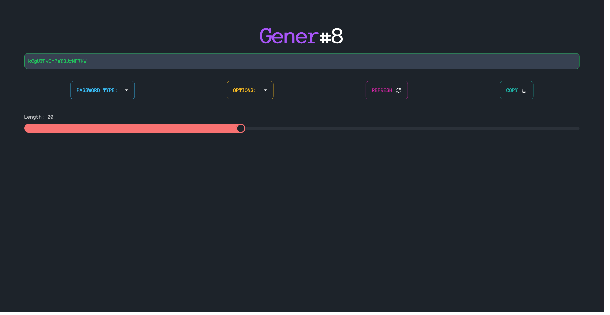

# Gener-8 Password Generator

A modern, secure password generator built with React, TypeScript, and Tailwind CSS.

## Features

### Core Features
- Generate secure passwords with customizable options (length, character types)
- Multiple password types (Alphabetical, Alphanumeric, Numerical, Pronounceable)
- Adjustable password length (3-150 characters)
- Copy to clipboard with feedback
- Light/dark mode support

### Password Statistics & Analysis
- Visual password strength meter with entropy calculation
- Shannon entropy measurement (bits/symbol)
- Character distribution analysis
- Uniqueness score compared to common patterns
- Character class diversity percentage
- Similar character detection and scoring
- Memorability scoring
- Estimated time to crack calculation
- Vulnerability assessment for different attack methods
- Security standards compliance (NIST, PCI DSS, HIPAA)
- Potential attack vectors identification

### Password Management & Security
- Password history tracking with session storage
- Mnemonic password aids to help remember complex passwords
- Acrostic and word association memory techniques
- Password breach checking against known data breaches (via Have I Been Pwned API)

## Development

### Installation

```bash
bun install
```

### Running the application

```bash
bun dev
```

### Testing

The application uses Vitest and React Testing Library for unit and component testing.

```bash
# Run all tests
bun test

# Run tests with watch mode
bun test:watch

# Generate test coverage report
bun test:coverage
```

### Building for production

```bash
bun run build
```

## Architecture

The application uses a component-based architecture with React and TypeScript. State management is handled with React hooks. The UI is built with Tailwind CSS for responsive design and theme support.

Key components include:
- Password generator with multiple types and options
- Comprehensive password strength and statistical analysis
- Memory aids for complex passwords (mnemonic techniques)
- Password breach detection
- Session-based password history



###### That's right, it's another password generator! Because there aren't enough of these around already...

